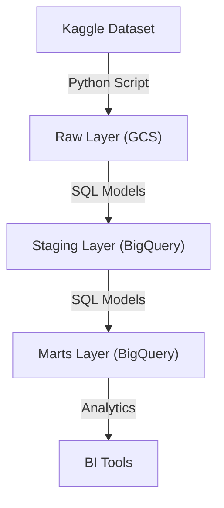
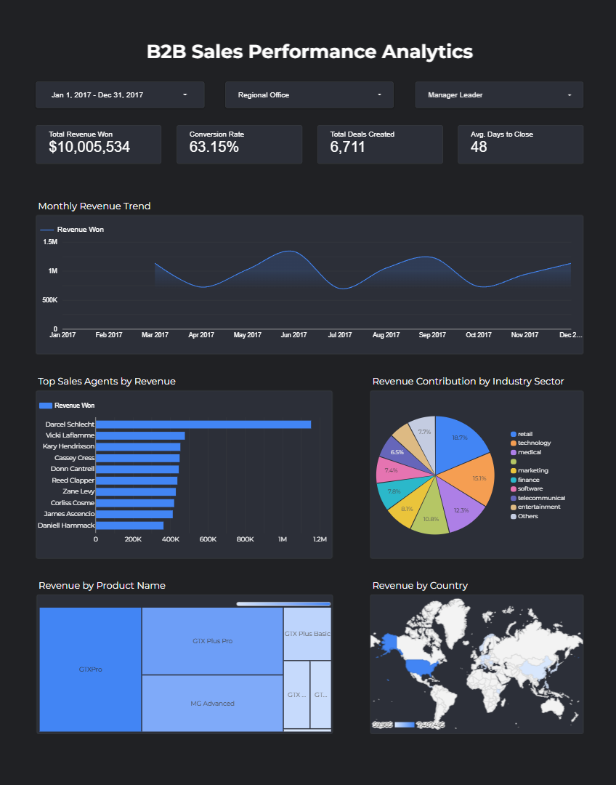

# B2B Sales Pipeline Data Engineering Project

## Problem Description

In the competitive world of B2B sales, data-driven decision-making is critical for success. This project implements a robust data pipeline to streamline the ingestion, transformation, and analysis of sales data. By leveraging modern data engineering practices, the pipeline enables sales teams to:

- Gain insights into sales performance and trends.
- Optimize resource allocation and sales strategies.
- Improve forecasting accuracy and decision-making.

The pipeline processes raw data from a Kaggle dataset, transforms it into meaningful insights, and stores it in a BigQuery data warehouse optimized for analytics.

---

## Architecture

This project follows the **Medallion Architecture**, which organizes data into three layers:

1. **Raw Layer**:
   - Data is ingested from the Kaggle dataset `innocentmfa/crm-sales-opportunities` using the Python script `extract_load.py`.
   - Files such as `accounts.csv`, `products.csv`, and `sales_pipeline.csv` are downloaded, cleaned, and uploaded to a Google Cloud Storage bucket (`raw_crm_data`).

2. **Staging Layer**:
   - Data is transformed into a structured format using SQL models in the `staging` dataset.
   - Example transformations:
     - Cleaning and standardizing column names.
     - Casting data types for consistency.
     - Handling null values for safe joins.

3. **Marts Layer**:
   - The final layer aggregates and enriches data for analytics.
   - Fact and dimension tables are created, such as `fct_sales_performance`, `dim_accounts`, and `dim_products`.

### Data Flow Diagram



---

## Dataset Overview

The project uses the CRM Sales Opportunities dataset, which provides a realistic look into B2B sales cycles. 
- **Timeframe:** The analysis focus on the period from **March 2017 to December 2017**, specifically for "Revenue Won" metrics.
- **Context:** This specific window allows for a deep dive into sales agent performance and quarterly revenue forecasting within that fiscal year.

---

## Data Warehouse Optimization

The `fct_sales_performance` table in the marts layer is optimized for analytical queries using:

- **Partitioning**:
  - The table is partitioned by the `close_date` column, enabling efficient time-based queries.

- **Clustering**:
  - The table is clustered by `sales_agent` and `deal_stage`, improving query performance for common filtering and grouping operations.

These strategies reduce query latency and cost, making the data warehouse highly performant.

---

## Dashboard Analytics

The final step of this pipeline is visualizing the transformed data to provide actionable insights for the business. A comprehensive single-page dashboard was built using Google Looker Studio.

- **Dashboard Link**: https://datastudio.google.com/reporting/c3be1f99-5905-43dc-b8d2-7ae935e51c3a
- **Key Metrics Tracked**: Total Revenue Won, Conversion Rate, Total Deals Created, and Average Days to Close.
- **Visualizations**: Includes a Monthly Revenue Trend line chart, Deals Distribution by Industry pie chart, and granular leaderboards for Top Sales Agents, Products, and Countries.



---

## Reproducibility

Follow these steps to set up and run the pipeline:

### 1. Set Up Credentials
- **Google Cloud Platform:** Authenticate your local environment to access BigQuery and GCS by running:
  ```bash
  gcloud auth application-default login
  ```
- **Kaggle API:** Create a `.env` file in the project root with the following content:
  ```env
  KAGGLE_USERNAME=YOUR_KAGGLE_USERNAME_HERE
  KAGGLE_KEY=YOUR_KAGGLE_KEY_HERE
  ```
- **Bruin Environment:** Rename the provided .bruin.yml.example file to .bruin.yml. Open it and replace YOUR_GCP_PROJECT_ID_HERE with your actual GCP Project ID.

### 2. Install Dependencies
- Install Python packages:
  ```bash
  pip install -r requirements.txt
  ```

### 3. Deploy Infrastructure
- Navigate to the `terraform` directory:
  ```bash
  cd terraform
  ```
- Initialize and apply Terraform configurations:
  ```bash
  terraform init
  terraform apply
  ```

### 4. Run the Pipeline
- Execute the pipeline using Bruin:
  ```bash
  bruin run
  ```

---

## Features

- Automated data ingestion from Kaggle using the Kaggle API.
- Data storage in Google Cloud Storage (GCS) for raw data.
- Structured transformation of raw data into staging tables using SQL models.
- Creation of analytics-ready fact and dimension tables in BigQuery.
- Optimization of BigQuery tables with partitioning and clustering for efficient querying.
- Infrastructure as Code (IaC) using Terraform for reproducible and scalable deployments.
- Integration with Google Looker Studio for interactive dashboards and visualizations.

---

## Pipeline Layers

### Ingestion
| File Name         | Description                                                                 |
|-------------------|-----------------------------------------------------------------------------|
| `extract_load.py` | Python script for downloading data from Kaggle, cleaning, and uploading to GCS. |

### Staging
| File Name              | Description                                                                 |
|------------------------|-----------------------------------------------------------------------------|
| `stg_accounts.sql`     | Transforms raw account data into a structured staging table.                |
| `stg_products.sql`     | Transforms raw product data into a structured staging table.                |
| `stg_sales_pipeline.sql` | Transforms raw sales pipeline data into a structured staging table.         |
| `stg_sales_teams.sql`  | Transforms raw sales team data into a structured staging table.             |

### Marts
| File Name              | Description                                                                 |
|------------------------|-----------------------------------------------------------------------------|
| `dim_accounts.sql`     | Creates a dimension table for account data.                                |
| `dim_products.sql`     | Creates a dimension table for product data.                                |
| `dim_sales_teams.sql`  | Creates a dimension table for sales team data.                             |
| `fct_sales_performance.sql` | Creates a fact table for sales performance metrics.                     |

---

## Tech Stack

| Technology                  | Purpose                                      |
|-----------------------------|----------------------------------------------|
| **Google Cloud Storage**    | Data Lake for storing raw data.             |
| **BigQuery**                | Data Warehouse for structured data storage. |
| **Terraform**               | Infrastructure as Code (IaC) for deployment.|
| **Python**                  | Data ingestion and transformation.          |
| **SQL**                     | Data modeling and transformation.           |
| **Bruin**                   | Pipeline orchestration.                     |
| **Google Looker Studio**    | Data visualization and dashboarding.        |

---

## Project Structure

```
zoomcamp-final-project/
│
├── bruin-pipeline/
│   ├── pipeline.yml
│   ├── assets/
│   │   ├── ingestion/
│   │   │   └── extract_load.py
│   │   ├── marts/
│   │   │   ├── dim_accounts.sql
│   │   │   ├── dim_products.sql
│   │   │   ├── dim_sales_teams.sql
│   │   │   └── fct_sales_performance.sql
│   │   └── staging/
│   │       ├── stg_accounts.sql
│   │       ├── stg_products.sql
│   │       ├── stg_sales_pipeline.sql
│   │       └── stg_sales_teams.sql
│
├── terraform/
│   ├── .terraform.lock.hcl
│   ├── main.tf
│   ├── terraform.tfstate
│   ├── terraform.tfstate.backup
│   ├── terraform.tfvars
│   └── variables.tf
│
├── .bruin.yml
├── .bruin.yml.example
├── .env.example
├── requirements.txt
├── .gitignore
└── README.md
```

---

## Acknowledgments

- Kaggle dataset: [CRM Sales Opportunities](https://www.kaggle.com/datasets/innocentmfa/crm-sales-opportunities)
- Google Cloud Platform for providing scalable data infrastructure.